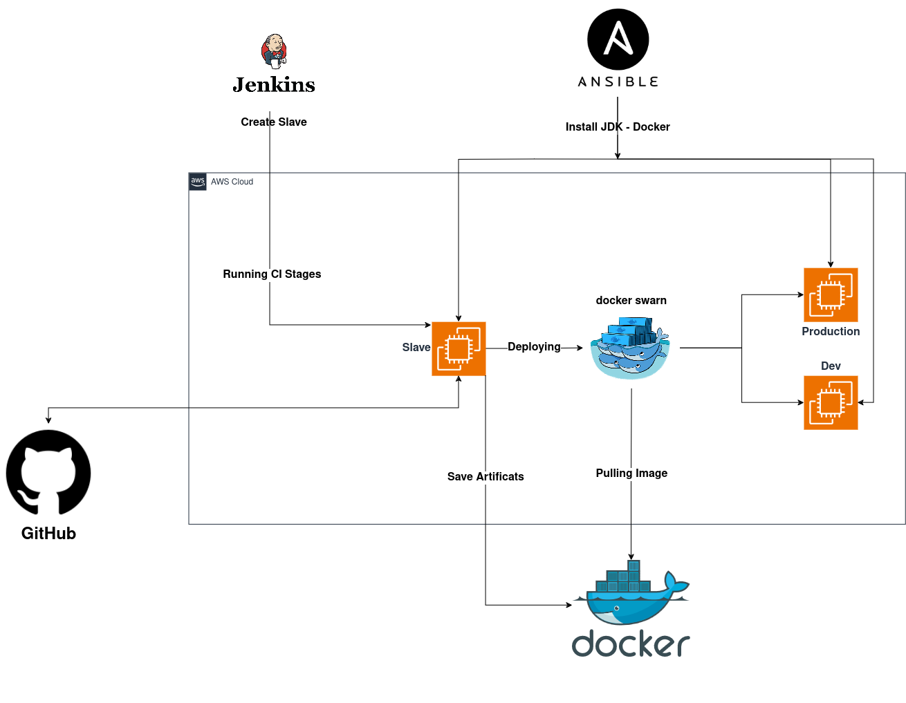
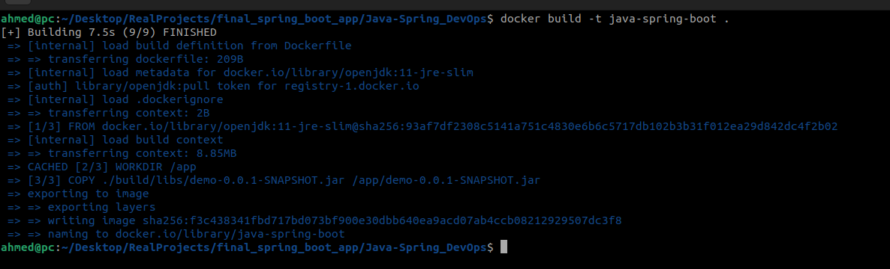
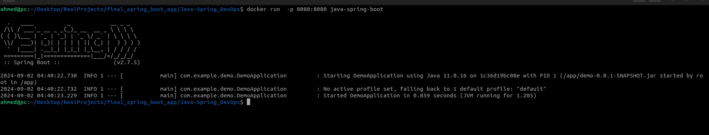

# Java-Spring-Boot APP using DevOps Tools 

## Overview

This project shows how to build a project using DevOps Tools (git,ansible,jenkins,docker,docker compose,docker swarm)

## Prerequisites

- Setting up a Github repo with dev branch
- Configure EC2 instance as a Jenkins slave  
- Create ansible playbook to install JDK and Docker
- Create Docker file to build our app 
- Create Docker Compose file
- Perform lint, test, build , dpeloy stages using pipeline
- Deploying with Docker Swarm

## Architecture



## Building and Testing

- Building image from Dockerfile

```
docker build -t java-spring-boot .
```



- run container from downloaded image

```
docker run -p 8080:8080 java-spring-boot
```

